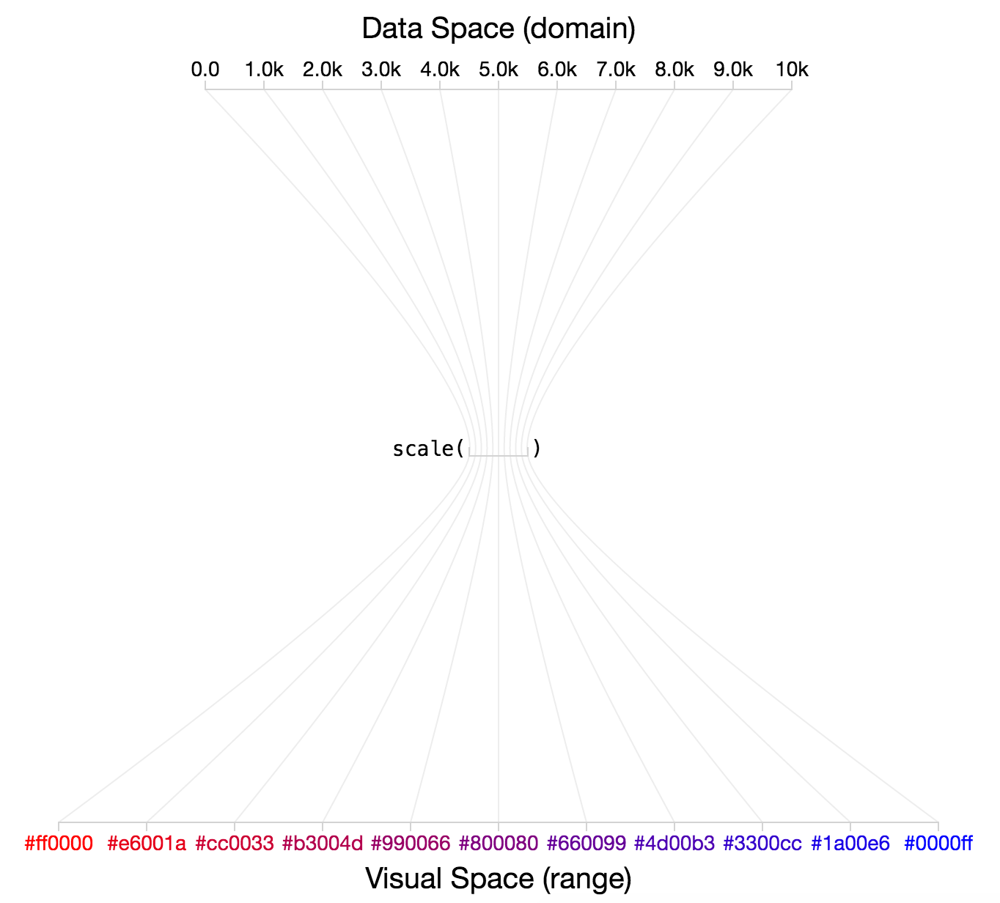
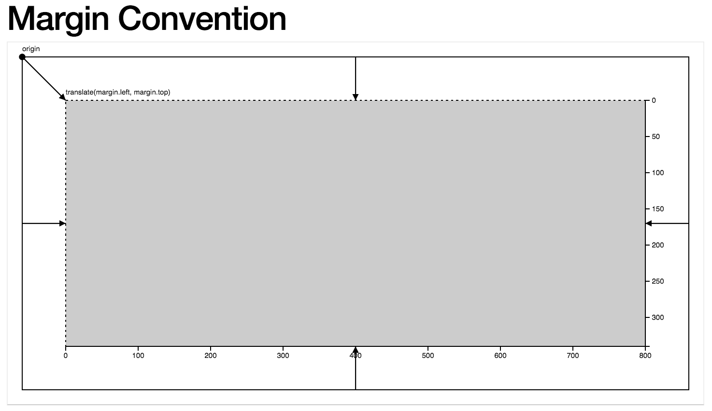

# D3 Scales

In this module, we'll explore how **scales** allow you to translate from a _data space_ to a _visual space_. As you know, your datasets will rarely (never) be in pixels. Scales will provide you with functions that allow you to express your data in pixels, regardless of the **domain** of your data.

It's important to distinguish between **scales** and **axes**. For the the sake of this (and other) modules, **scales** will refer to _functions_ that translate between the data space and visual space. **Axes** are visual representations of scales, in that they allow your audience to translate from a visual space back into a data space. Not surprisingly, you'll need to use your scales to build your axes.

Helpful links

- [Quantitative Scales](https://github.com/mbostock/d3/wiki/Quantitative-Scales) _(d3 wiki)_
- [Ordinal Scales](https://github.com/mbostock/d3/wiki/Ordinal-Scales) _(d3 wiki)_
- [Categorical Colors](https://github.com/mbostock/d3/wiki/Ordinal-Scales#categorical-colors) _(d3 wiki)_
- [Scale Tutorial](http://alignedleft.com/tutorials/d3/scales) _(aligned left)_
- [Scale Overview](http://www.jeromecukier.net/blog/2011/08/11/d3-scales-and-color/) _(Jerome Cukier)_
- [D3 Array Manipulation](https://github.com/mbostock/d3/wiki/Arrays) _(d3 wiki)_
- [D3 min Function](https://github.com/mbostock/d3/wiki/Arrays#d3_min) _(d3 wiki)_
- [D3 set values](https://github.com/mbostock/d3/wiki/Arrays#set_values) _(d3 wiki)_
- [D3 Categorical Colors](https://github.com/mbostock/d3/wiki/Ordinal-Scales#categorical-colors) _(d3 wiki)_
- [D3 SVG Axes](https://github.com/mbostock/d3/wiki/SVG-Axes) _(d3 wiki)_
- [D3 Margin Convention](https://bl.ocks.org/mbostock/3019563) _(bl.ock example)_

## Conceptual Overview
As described above, D3 scales are functions that allow you to translate between the **domain** of your data and your visual **range**. In previous modules, we often used data values directly for positioning elements in the DOM

```javascript
svg.selectAll('circle') // select all circles in the svg
 .data(data, function(d){return d.id}) // bind the data to your selection
 .attr('r', 5) // set a constant radius of 5
 .attr('cx', function(d) {return d.x}) // specify the x attribute using the x value
 .attr('cy', function(d) {return d.y}); // specify the y attribute using the y value
```

However, depending on your dataset, your `x` and `y` values will either be very small (.000001) or very larger (1E23). **Scales** will allow you to take in a data-value and return a pixel-value. In pseudo-code:

```javascript
var scale = function(data-value) {
  // calculate pixel-value
  return pixel-value;
};
```

It would be somewhat trivial to write linear transformations yourself, but there's no point in re-inventing the wheel. Regardless of your implementation, there are a few pieces of information you'll need to build a scale:

>**Domain of data**: In order to calculate the visual output, you'll need to know that possible set of values covered in your data-variable. In the case of quantitative (continuous) variables, this could be defined using a minimum and maximum value of your dataset. For ordinal data, you'll need to provide additional information about the possible set of values present in your data.


>**Range of Output**: In order to create proper visual representations of your data, you'll need to establish the desired output range of your scale. In other words, you need to decide the set of possible pixels that express your underlying dataset. As with your domain, this could be expressed with a minimum and maximum (pixel value) for continuous data, and for ordinal data, you need to define the set of possible (pixel) values (there are a few different ways you can think about specifying this).

As you know, in JavaScript, functions are actually objects. The implication of this is that the scale functions (objects) you create using D3 will have various properties that allow you to describe the behaviors of the scale. As described [on the wiki](https://github.com/mbostock/d3/wiki/Ordinal-Scales):

>You can call the scale like any other function, and the scale has additional methods that change its behavior. Like other classes in D3, scales follow the method chaining pattern where setter methods return the scale itself, allowing multiple setters to be invoked in a concise statement.

Before we start defining scale objects, it's helpful to cover a few related functions provided by D3 to make processing data easier.

## Helper Functions
As indicated in the section above, there are a number of pieces of information that you need in order to build a scale. D3 provides you with a variety of array methods that make working with data easier. This section outlines how you can use the `d3.min` and `d3.max` functions to compute the necessary information for working with scales.

D3 provides helpful `d3.min` and `d3.max` functions to help you determine the minimum and maximum values in your data arrays:

```javascript
// Salaries dataset
var data = [0, 10000,...,100];

// Get minimum and maximum values
var min = d3.min(data); // returns minimum value in the array
var max = d3.max(data); // returns maximum value in the array
```

Because you'll frequently be working with arrays of objects, `d3.min` (and similar functions) provide you with an optional argument for specifying the _accessor_ (i.e., which property you would like to access from each object):

```javascript
// Salaries dataset, with names
var data = [{name:'Jim', salary:10000}, {name:'Rex', salary:100}, {name:'Irene', salary:0}];

// Get minimum and maximum salary values
var min = d3.min(data, function(d){return d.salary}); // returns minimum salary
var max = d3.max(data, function(d){return d.salary}); // returns maximum salary
```

For ordinal scales, it's quite helpful to be able to determine the unique set of discrete values in an array. For example, imagine you have `job_type` as an additional piece of information in the data array above. To construct an ordinal scale, you'll need to determine the unique set of jobs that appear in your dataset. The `d3.set` method allows you to easily retrieve this informaiton:

```javascript
var data = [{name:'Jim', job_type:'camp counselor', salary:10000},
            {name:'Rex', job_type:'accountant', salary:100},
            {name:'Irene', job_type:'accountant', salary:0}];

// Store the job_type property of each element in a variable
var jobs = data.map(function(d){return d.job_type});

// Get unique set of job_types that appear in the dataset
d3.set(jobs).values(); // returns ['camp counselor', 'accountant']
```

## Quantitative Scales
Quantitative scales allow you to translate between a continuous _data-domain_ and a continuous _output-range_. Let's imagine an example dataset where you had summer internship salaries that ranged from $0 to $10K (**data domain**). If you wanted to represent those using horizontal position you would want to express that set of values in a limited number of pixels, say 0 - 600 pixels (**output range**). To do this, you would use the `d3.scale` method to create a linear scale function. Before we dive into the syntax, here is a visual representation of the role of quantitative scales (code is in [demo-1](demo-1)):


Here is the code used to define your scale object and set the necessary inputs (domain and range):

```javascript
// Define a linear scale object
var salaryScale = d3.scale.linear();

// Set the domain of the input data for your scale
salaryScale.domain([0, 10000]);

// Set the range of the visual output for your scale
salaryScale.range([0, 600]);

// With method-chaining, you could do all of the above steps in one sequence
var salaryScale = d3.scale.linear().domain([0, 10000]).range([0, 600]);
```

Once you have defined your scale function, you can pass in a value in your **data domain** and it will return a value in your **output range**. Using the pixel value returned by the function, you could then build your chart.

```javascript
// Get desired pixel value for minimum data value, $0
salaryScale(0); // returns 0, the minimum of the range

// Get desired pixel value for maximum data value, $10K
salaryScale(10000); // returns 600, the maximum of the range

// Get desired pixel value for central data value, $5K
salaryScale(5000); // returns 300, the center of the range

```

## Ordinal Scales
Ordinal scales allow you to translate between a discrete _data-domain_ and a discrete _output-range_. Let's imagine an example dataset where you had an array of data of the letters `A` through `J` (**data domain**). If you wanted to represent those using horizontal position you would want to express each value between, say, 0 - 600 pixels (**output range**). To do this, you would use the `d3.scale` method to create an ordinal scale function. Before we dive into the syntax, here is a visual representation of the role of ordinal scales (code is in [demo-2](demo-2)):


Defining an ordinal scale with D3 is similar to creating a linear scale, however there are a few more options for describing the behavior of the range. In order to set your **domain**, you'll need to provide the full set of possible values for your scale (i.e., each discrete value):

```javascript
// Data array of the letter 'A' through 'J'
var data = ['A', 'B', 'C', 'D', 'E', 'F', 'G', 'H', 'I', 'J'];

// Define an ordinal scale
var ordScale = d3.scale.ordinal();

// Set the domain of possible values
ordScale.domain(data); // pass in the full array of possible values

```

There are a few options for specifying the range of an ordinal scale. As you might expect, you can pass in a discrete set of values, whose indicies map to the corresponding data domain:

```javascript
// Data array
var data = ['A', 'B', 'C'];

// Desired output range
var range = [100, 200, 300]

// Define ordaial scale
var ordScale = d3.scale.ordinal().domain(data).range(range);

// Get pixel position for the letter 'B'
ordScale('B'); // returns 200
```

However, as you can imagine, this gets tedious quickly, especially as your data domain set grows (or changes). For this reason, there are a variety of additional methods you can use to set your range. The `rangePoints` and `rangeRoundPoints` methods allow you to specify the desired `interval` (i.e., minimum and maximum value), as well as how much you would like to offset your data from the edge of your scale (`padding`). These methods will *compute your range for your* by sub-dividing your interval into equal steps based on the number of values in your **data domain**. Note, these methods will **define your range** for you:

```javascript
var data = ['A', 'B', 'C', 'D', 'E', 'F', 'G', 'H', 'I', 'J'];

// Define an ordinal scale and its domain
var ordScale = d3.scale.ordinal().domain(data);

// Use the rangePoints method to set your range
ordScale.rangePoints([0, 100]); // Set the interval with no padding

// Return your scale, which has been set
ordScale.range() // returns [0, 11.1, 22.2, 33.3, 44.4, 55.5, 66.6, 77.7, 88.8, 100]

// Get pixel position for the letter 'E'
ordScale('E') // returns 44.4
```

## Color Scales
D3's ability to translate from data attributes to visual attributes, not surprisingly, extends to color encodings. These transformations leverage the same scale syntax, and provide linear/ordinal transformations from the data space (**domain**) to a visual (color) space (**range**). If we wanted to encode the salary data above with colors that range from red to blue (rather than position), we could simply change the `range` argument to our function:

```javascript
// Some sample data
var data = [0, .2, .5, 1];

// Define a linear color scale
var colorScale = d3.scale.linear().domain(data).range('red', 'blue');

// Get a color value
colorScale(0); // returns red
```

Here is a visual representation of the color transformation (code is in [demo-3](demo-3)):



Similarly, if you want to leverage an ordinal scale to have color outputs, you can specify the desired colors in the `range` method:

```javascript
// Data array
var data = ['A', 'B', 'C'];

// Desired output range
var range = ['red', 'green', 'blue']

// Define ordaial scale
var colorScale = d3.scale.ordinal().domain(data).range(range);

// Get color for the letter 'C'
colorScale('C') // returns 'blue'
```

D3 also provides some wonderful built in categorical color scales. While you can explicitly set the domain of these scale, they will dynamically set the domain as you pass in new elements to the scale.

```javascript
// Declare a new ordinal scale with pre-set color range
var colorScale = d3.scale.category10();

// Get a color for an arbitrary piece of data passed to the scale
colorScale('A') // returns the first value in the range, '#1f77b4'
```

These preset category scales are a great resource, but don't rely too heavily on them - they _are not_ the proper visual encoding for many dataset.

## Axes
**Axes** are visual representations of **scales**. While scales allow you to position an element (in pixels) based on it's data value, axes provide meaning to the pixels on the screen, allowing users to understand what each pixel means in terms of the data domain. Like anything else in your DOM, axes consist of HTML elements (`paths`, `lines`, and `text`) arranged to _look like axes_. Luckily, D3 provides us with a set of tools for defining, constructing, and manipulating axes based on changes to their corresponding scales.

### Axis Elements
Axes are `svg` elements that contain the necessary elements for communicating the range of your data. In order to define a scale, you'll need to provide the following information:

> The **selection** that should render your axis. You should select a `g` element and use the `.call` method to declare the context for rendering your axis

> The **scale** that is being expressed with the axis. The scale's `range` will determine the pixel range of the scale, ad the `domain` will be translated into tick values

> See the [documentation](https://github.com/mbostock/d3/wiki/SVG-Axes) for additional information you can provide to control visual layout.

Here is an example of how you could define and render an axis:

```javascript
// Define an axis for your scale with the ticks oriented on the bottom
var axis = d3.svg.axis() //define your axis function
                 .scale(scale) // sets the domain and range based on the domain/range of the scale
                 .orient('bottom'); // but ticks below the axis line

// Create a visual (g) element in which you want to render your axis
var axisLabel = svg.append("g") // append a `g` element
                    .attr("class", "axis") // assign the class "axis"
                    .attr("transform", "translate(25, 40)") // shift it 25 pixels right, 40 pixels down
                    .call(axis); // Call the axis in the context of the g element

```
For practice rendering an axis alongside the data being displayed, see [exercise-1](http://github.com/info474-s17/m13-scales/tree/master/exercise-1).

### Positioning Axes
The second challenge of working with axes is figuring out where to put them. Like other D3 elements, you'll need to specify the location of the `g` element in which you render your scale. Here is an [example](https://bl.ocks.org/mbostock/3019563) that suggests a convention for specifying the margin for your chart:



**Note**, the charting area (i.e., where all of your data symbols are rendered) is inside of an inner `g` element within you `svg`. This allows you to easily shift all of your markers without changing your scales. For example:

```javascript
// 'g' element in which to place the circles, shifted down from the top left
var g = svg.append('g')
    .attr('transform', 'translate(' +  margin.left + ',' + margin.top + ')')
    .attr('height', height)
    .attr('width', width);


// Bind data to your selection of circles within your `g` element
var circles = g.selectAll('circle').data(data)
```

Finally, if you want to label your axes, you'll simply have to put a piece of text in the right place in your SVG. For example:

```javascript
// Add a title g for the x axis
svg.append('text')
  .attr('transform', 'translate(' + (margin.left + width/2) + ',' + (height + margin.top + 40) + ')')
  .attr('class', 'title')
  .text('Gross Domestic Product in 2014 (2005 USD)');
```

To practice bringing these skills together on a real dataset, see [exercise-2](http://github.com/info474-s17/m13-scales/tree/master/exercise-2).
